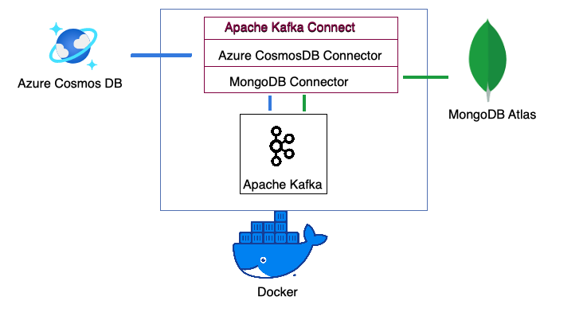

# CosmosDB to MongoDB Migration

While there are many ways to move data, using Kafka will allow you to not only perform a one time migration but to stream data from Azure CosmosDB Core (Native API) to MongoDB giving you the opportunity to test your application and compare the experience so that you can make the final application change to MongoDB Atlas when you are ready.

This repository contains a docker compose file that will stand up a minimal Apache Kafka environment with Kafka Connect, Broker, Zookeeper and will install the Azure CosmosDB and MongoDB Connectors for Apache Kafka.

# Getting Started

Git clone this repository then build the docker containers:

`Docker-compose up -d --build`

The docker compose script `docker-compose.yml` will stand up all the components you need including Apache Kafka, Kafka Connect, and install the CosmosDB and MongoDB connectors.

Next, configure Kafka Connect by modifing the `cosmosdb-source.json` file.  Replace the placeholder values with your own.

{
  "name": "cosmosdb-source",
  "config": {
    "connector.class": "com.azure.cosmos.kafka.connect.source.CosmosDBSourceConnector",
    "tasks.max": "1",
    "key.converter": "org.apache.kafka.connect.json.JsonConverter",
    "value.converter": "org.apache.kafka.connect.json.JsonConverter",
    "connect.cosmos.task.poll.interval": "100",
    "connect.cosmos.connection.endpoint": "https://<cosmosinstance-name>.documents.azure.com:443/",
    "connect.cosmos.master.key": "<cosmosdbprimarykey>",
    "connect.cosmos.databasename": "<database name>",
    "connect.cosmos.containers.topicmap": "<containers>#<topicname>”,
    "connect.cosmos.offset.useLatest": false,
    "value.converter.schemas.enable": "false",
    "key.converter.schemas.enable": "false"
  }
}

Next modify the `mongo-sink.json` file and replace the placeholder values with your own.

{"name": "mongo-sink",
    "config": {
      "connector.class":"com.mongodb.kafka.connect.MongoSinkConnector",
      "tasks.max":"1",
      "topics":"<topicname>",
      "connection.uri":"<MongoDB Atlas Connection String>",
      "database":"<Desired Database Name>",
      "collection":"<Desired Collection Name>",
      "key.converter": "org.apache.kafka.connect.json.JsonConverter",
      "value.converter":"org.apache.kafka.connect.json.JsonConverter",
      "value.converter.schemas.enable": "false",
      "key.converter.schemas.enable": "false"
      
 }}

To configure our two connectors make a REST API call to the Kafka Connect service:

`curl -X POST -H "Content-Type: application/json" -d @cosmosdb-source.json  http://localhost:8083/connectors`

`curl -X POST -H "Content-Type: application/json" -d @mongodb-sink.json  http://localhost:8083/connectors`

That’s it!  Now your CosmosDB data is being streamed to MongoDB Atlas.

If you are having trouble seeing data double check that you have proper network and database access.  By default MongoDB Atlas does not allow remote connections.

